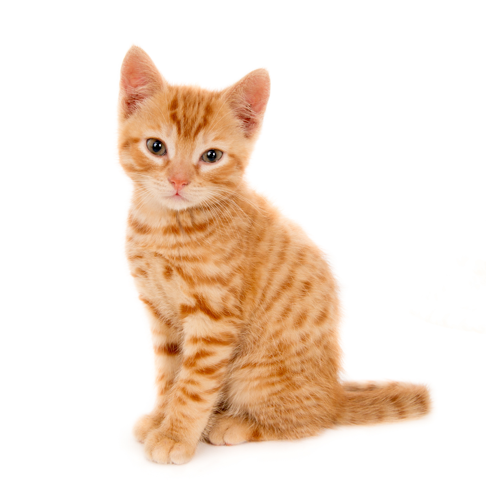
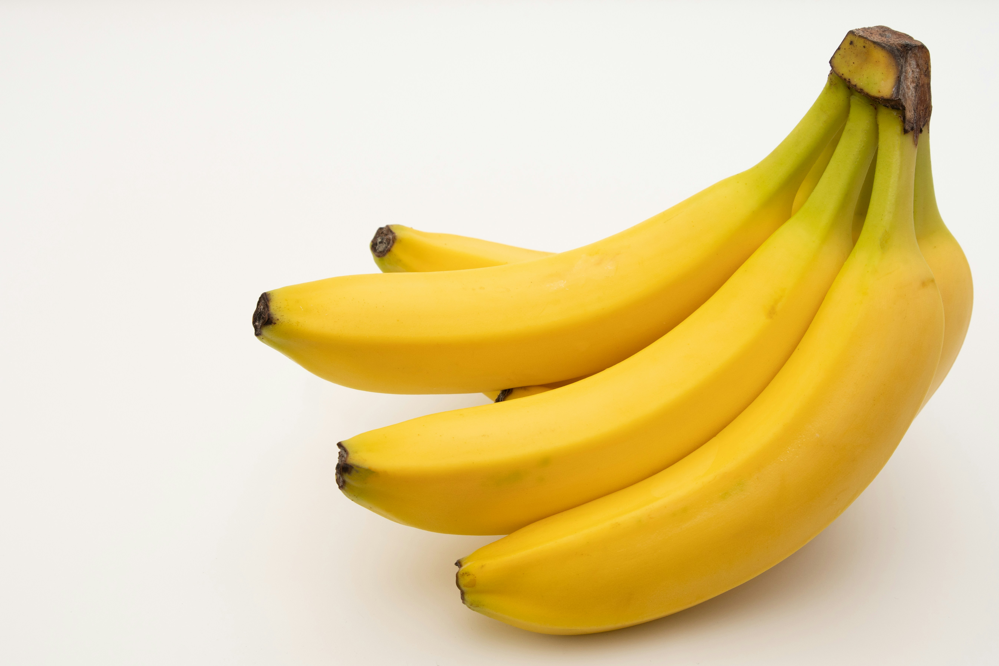
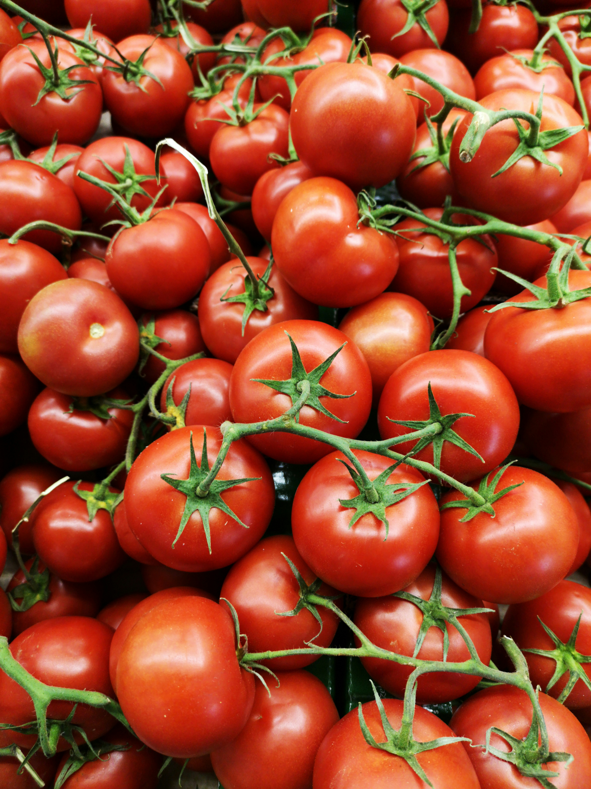

# 🧠 Pretrained Image Classification

### 🔍 Give an image. Let AI figure out what's inside.

A beginner-friendly **Image Classification** project built using  
**Python, TensorFlow, and MobileNetV2**.

Instead of training a neural network from scratch, this project uses a  
**pretrained deep learning model** to recognize objects in a small  
collection of sample images.

---

<p align="center">
  
  
  
  
</p>

---

## 🎯 What Does This Project Do?

The program takes an image and passes it through a pretrained  
**MobileNetV2** neural network.

The model then predicts what the image most likely contains and  
displays the **top 3 predictions with confidence scores**.

### 🔄 Classification Pipeline

```text
📷 Input Image
       ↓
🔄 Image Preprocessing
       ↓
🧠 MobileNetV2
       ↓
📊 Prediction
       ↓
🏷️ Predicted Label + Confidence
```

---

## 🖼️ Sample Images

The project uses a small collection of images for demonstration:

<table>
  <tr>
    <td align="center">
      <br>
      <b>🐶 Dog</b>
    </td>
    <td align="center">
      <br>
      <b>🐱 Cat</b>
    </td>
    <td align="center">
      <br>
      <b>🚗 Car</b>
    </td>
  </tr>
  <tr>
    <td align="center">
      <br>
      <b>🍌 Banana</b>
    </td>
    <td align="center">
      <br>
      <b>🏔️ Hill</b>
    </td>
    <td align="center">
      <br>
      <b>🍅 Tomato</b>
    </td>
  </tr>
</table>

---

## 🧠 How Does It Work?

The project follows a simple six-step process.

### 1️⃣ Load the Model

MobileNetV2 is loaded with weights that were already trained on  
the **ImageNet** dataset.

```python
model = tf.keras.applications.MobileNetV2(weights="imagenet")
```

### 2️⃣ Read the Image

The program reads images from:

```text
sample_images/
```

### 3️⃣ Resize the Image

Each image is resized to:

```text
224 × 224 pixels
```

This is the standard input size used by MobileNetV2.

### 4️⃣ Preprocess the Image

The image is converted into the format expected by the neural network.

### 5️⃣ Make a Prediction

The image is passed through MobileNetV2.

The model produces probabilities for different ImageNet classes.

### 6️⃣ Display the Result

The program displays:

- 🏷️ Predicted label
- 📊 Confidence score
- 🔝 Top 3 possible classes
- 🖼️ Original image

---

## 🔬 What Is a Pretrained Model?

Training a deep learning model from scratch requires a large dataset,  
a lot of computing power, and considerable training time.

A **pretrained model** has already learned useful visual features  
from a large dataset.

For example, a neural network can learn patterns such as:

```text
Edges
  ↓
Shapes
  ↓
Textures
  ↓
Object Features
  ↓
Object Categories
```

In this project, we reuse the knowledge learned by MobileNetV2 to  
classify new images.

This makes the project smaller, faster, and easier to understand.

---

## 🚀 Why MobileNetV2?

**MobileNetV2** is a lightweight convolutional neural network designed  
for efficient image recognition.

### ⭐ Advantages

- ⚡ Lightweight
- 🚀 Fast inference
- 🧠 Already pretrained
- 📦 Easy to use with TensorFlow
- 💻 Suitable for beginner projects
- 📊 Supports many ImageNet classes

---

## 🛠️ Technologies Used

| Technology | Purpose |
|---|---|
| 🐍 **Python** | Main programming language |
| 🧠 **TensorFlow** | Deep learning framework |
| 🔍 **MobileNetV2** | Pretrained image classification model |
| 🖼️ **Pillow** | Image processing |
| 📊 **Matplotlib** | Displaying images and predictions |
| 🌐 **GitHub** | Project hosting and version control |

---

## 📁 Project Structure

```text
Pretrained-Image-Classification/
│
├── 📂 sample_images/
│   ├── 🖼️ BANANA.jpg
│   ├── 🖼️ CAR.jpg
│   ├── 🖼️ CAT.jpg
│   ├── 🖼️ DOG.jpg
│   ├── 🖼️ HILL.jpg
│   └── 🖼️ TOMATO.jpg
│
├── 🐍 main.py
├── 📦 requirements.txt
├── 📖 README.md
├── 🚫 .gitignore
└── 📄 LICENSE
```

---

## ⚙️ Installation

### 1️⃣ Clone the Repository

```bash
git clone https://github.com/veerunad021-prog/Pretrained-Image-Classification.git
```

### 2️⃣ Open the Project

```bash
cd Pretrained-Image-Classification
```

### 3️⃣ Install Dependencies

```bash
pip install -r requirements.txt
```

---

## ▶️ Run the Project

Make sure your images are inside:

```text
sample_images/
```

Then run:

```bash
python main.py
```

The program will automatically find the images and classify them.

---

## 📊 Example Terminal Output

The program produces output similar to:

```text
==================================================
Image: DOG.jpg
==================================================

golden_retriever: 85.32%
Labrador_retriever: 8.41%
kuvasz: 1.92%
```

The image is also displayed with the top prediction and its  
confidence score.

> 💡 **Note:** The confidence score represents the model's predicted
> probability for that class. A high score does not always mean the
> prediction is correct.

---

## 🎓 What I Learned

Through this project, I learned:

- 🧠 What pretrained models are
- 🔍 How image classification works
- 📦 How to use TensorFlow models
- 🖼️ How to preprocess images
- 📊 How prediction probabilities work
- 🐍 How Python can be used for AI applications
- 🌐 How to manage a project using Git and GitHub

---

## 💡 Key Idea

> **You don't always need to train an AI model from scratch.**

Pretrained models allow us to take advantage of knowledge learned from  
large datasets and use it for new image classification tasks.

---

## 🔮 Possible Future Improvements

This project can be extended by:

- 📷 Adding webcam-based classification
- 🌐 Building a simple web interface
- 📱 Creating a mobile application
- 📈 Showing prediction graphs
- 🧠 Fine-tuning the model for a custom dataset
- 📤 Allowing users to upload their own images

---

## 🏁 Conclusion

This project demonstrates how a **pretrained deep learning model** can  
be used to classify images with only a small amount of code and data.

By using **MobileNetV2 + TensorFlow**, we can perform image  
classification without training a large neural network from scratch.

---

## ⭐ Support

If you found this project useful, consider giving it a ⭐ on GitHub!

### Built with 🧠 AI + 🐍 Python + ❤️ Curiosity# 🧠 Pretrained Image Classification

### 🔍 Give an image. Let AI figure out what's inside.

A beginner-friendly **Image Classification** project built using  
**Python, TensorFlow, and MobileNetV2**.

Instead of training a neural network from scratch, this project uses a  
**pretrained deep learning model** to recognize objects in a small  
collection of sample images.

---

<p align="center">
  
  
  
  
</p>

---

## 🎯 What Does This Project Do?

The program takes an image and passes it through a pretrained  
**MobileNetV2** neural network.

The model then predicts what the image most likely contains and  
displays the **top 3 predictions with confidence scores**.

### 🔄 Classification Pipeline

```text
📷 Input Image
       ↓
🔄 Image Preprocessing
       ↓
🧠 MobileNetV2
       ↓
📊 Prediction
       ↓
🏷️ Predicted Label + Confidence
```

---

## 🖼️ Sample Images

The project uses a small collection of images for demonstration:

<table>
  <tr>
    <td align="center">
      <br>
      <b>🐶 Dog</b>
    </td>
    <td align="center">
      <br>
      <b>🐱 Cat</b>
    </td>
    <td align="center">
      <br>
      <b>🚗 Car</b>
    </td>
  </tr>
  <tr>
    <td align="center">
      <br>
      <b>🍌 Banana</b>
    </td>
    <td align="center">
      <br>
      <b>🏔️ Hill</b>
    </td>
    <td align="center">
      <br>
      <b>🍅 Tomato</b>
    </td>
  </tr>
</table>

---

## 🧠 How Does It Work?

The project follows a simple six-step process.

### 1️⃣ Load the Model

MobileNetV2 is loaded with weights that were already trained on  
the **ImageNet** dataset.

```python
model = tf.keras.applications.MobileNetV2(weights="imagenet")
```

### 2️⃣ Read the Image

The program reads images from:

```text
sample_images/
```

### 3️⃣ Resize the Image

Each image is resized to:

```text
224 × 224 pixels
```

This is the standard input size used by MobileNetV2.

### 4️⃣ Preprocess the Image

The image is converted into the format expected by the neural network.

### 5️⃣ Make a Prediction

The image is passed through MobileNetV2.

The model produces probabilities for different ImageNet classes.

### 6️⃣ Display the Result

The program displays:

- 🏷️ Predicted label
- 📊 Confidence score
- 🔝 Top 3 possible classes
- 🖼️ Original image

---

## 🔬 What Is a Pretrained Model?

Training a deep learning model from scratch requires a large dataset,  
a lot of computing power, and considerable training time.

A **pretrained model** has already learned useful visual features  
from a large dataset.

For example, a neural network can learn patterns such as:

```text
Edges
  ↓
Shapes
  ↓
Textures
  ↓
Object Features
  ↓
Object Categories
```

In this project, we reuse the knowledge learned by MobileNetV2 to  
classify new images.

This makes the project smaller, faster, and easier to understand.

---

## 🚀 Why MobileNetV2?

**MobileNetV2** is a lightweight convolutional neural network designed  
for efficient image recognition.

### ⭐ Advantages

- ⚡ Lightweight
- 🚀 Fast inference
- 🧠 Already pretrained
- 📦 Easy to use with TensorFlow
- 💻 Suitable for beginner projects
- 📊 Supports many ImageNet classes

---

## 🛠️ Technologies Used

| Technology | Purpose |
|---|---|
| 🐍 **Python** | Main programming language |
| 🧠 **TensorFlow** | Deep learning framework |
| 🔍 **MobileNetV2** | Pretrained image classification model |
| 🖼️ **Pillow** | Image processing |
| 📊 **Matplotlib** | Displaying images and predictions |
| 🌐 **GitHub** | Project hosting and version control |

---

## 📁 Project Structure

```text
Pretrained-Image-Classification/
│
├── 📂 sample_images/
│   ├── 🖼️ BANANA.jpg
│   ├── 🖼️ CAR.jpg
│   ├── 🖼️ CAT.jpg
│   ├── 🖼️ DOG.jpg
│   ├── 🖼️ HILL.jpg
│   └── 🖼️ TOMATO.jpg
│
├── 🐍 main.py
├── 📦 requirements.txt
├── 📖 README.md
├── 🚫 .gitignore
└── 📄 LICENSE
```

---

## ⚙️ Installation

### 1️⃣ Clone the Repository

```bash
git clone https://github.com/veerunad021-prog/Pretrained-Image-Classification.git
```

### 2️⃣ Open the Project

```bash
cd Pretrained-Image-Classification
```

### 3️⃣ Install Dependencies

```bash
pip install -r requirements.txt
```

---

## ▶️ Run the Project

Make sure your images are inside:

```text
sample_images/
```

Then run:

```bash
python main.py
```

The program will automatically find the images and classify them.

---

## 📊 Example Terminal Output

The program produces output similar to:

```text
==================================================
Image: DOG.jpg
==================================================

golden_retriever: 85.32%
Labrador_retriever: 8.41%
kuvasz: 1.92%
```

The image is also displayed with the top prediction and its  
confidence score.

> 💡 **Note:** The confidence score represents the model's predicted
> probability for that class. A high score does not always mean the
> prediction is correct.

---

## 🎓 What I Learned

Through this project, I learned:

- 🧠 What pretrained models are
- 🔍 How image classification works
- 📦 How to use TensorFlow models
- 🖼️ How to preprocess images
- 📊 How prediction probabilities work
- 🐍 How Python can be used for AI applications
- 🌐 How to manage a project using Git and GitHub

---

## 💡 Key Idea

> **You don't always need to train an AI model from scratch.**

Pretrained models allow us to take advantage of knowledge learned from  
large datasets and use it for new image classification tasks.

---

## 🔮 Possible Future Improvements

This project can be extended by:

- 📷 Adding webcam-based classification
- 🌐 Building a simple web interface
- 📱 Creating a mobile application
- 📈 Showing prediction graphs
- 🧠 Fine-tuning the model for a custom dataset
- 📤 Allowing users to upload their own images

---

## 🏁 Conclusion

This project demonstrates how a **pretrained deep learning model** can  
be used to classify images with only a small amount of code and data.

By using **MobileNetV2 + TensorFlow**, we can perform image  
classification without training a large neural network from scratch.

---

## ⭐ Support

If you found this project useful, consider giving it a ⭐ on GitHub!

### Built with 🧠 AI + 🐍 Python + ❤️ Curiosity